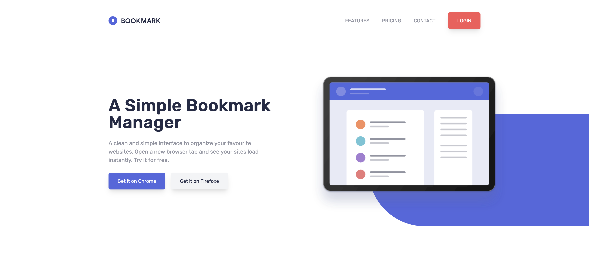

# Bookmark Landing Page

This project is my practics for tailwindcss and gsap.

Challange [link](https://www.frontendmentor.io/challenges/bookmark-landing-page-5d0b588a9edda32581d29158)

[Live Page](https://bookmark-landing-page-hg.netlify.app/)



## Usage

Install dependencies

```bash
npm install
```

Run the Tailwind CLI to compile the style.css during development.

```bash
npm run watch
```
